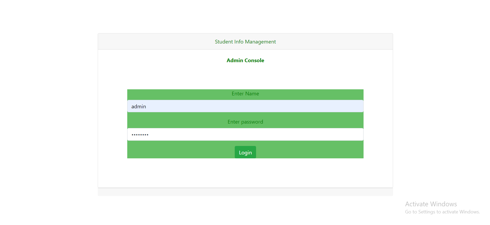

# Student_Info_management_CRUD
## used tools
1) Eclipse IDE
2) MySQL Server(8.0.17)
3) SqlYog as a client of MySQL
4) JDBC(Version 8..13)
5) Servlet
6) Tomcat server(versio 9.0)
7) HTML, Bootstrap, Javascript

Implemented basically CRUD operations on student database by using Java web techologies Servlet, JSP and mysql.
### Frontend interfaces

